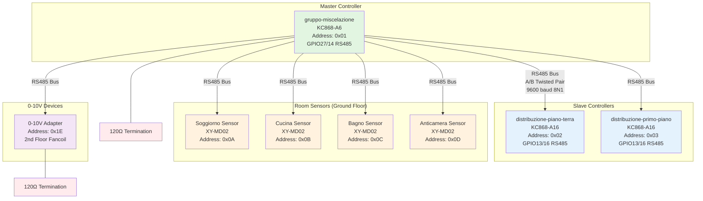
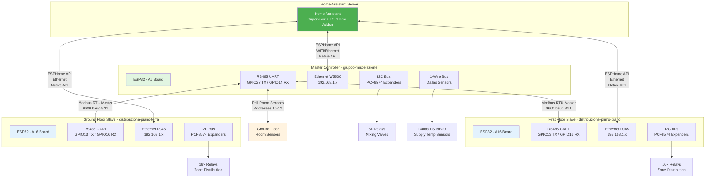
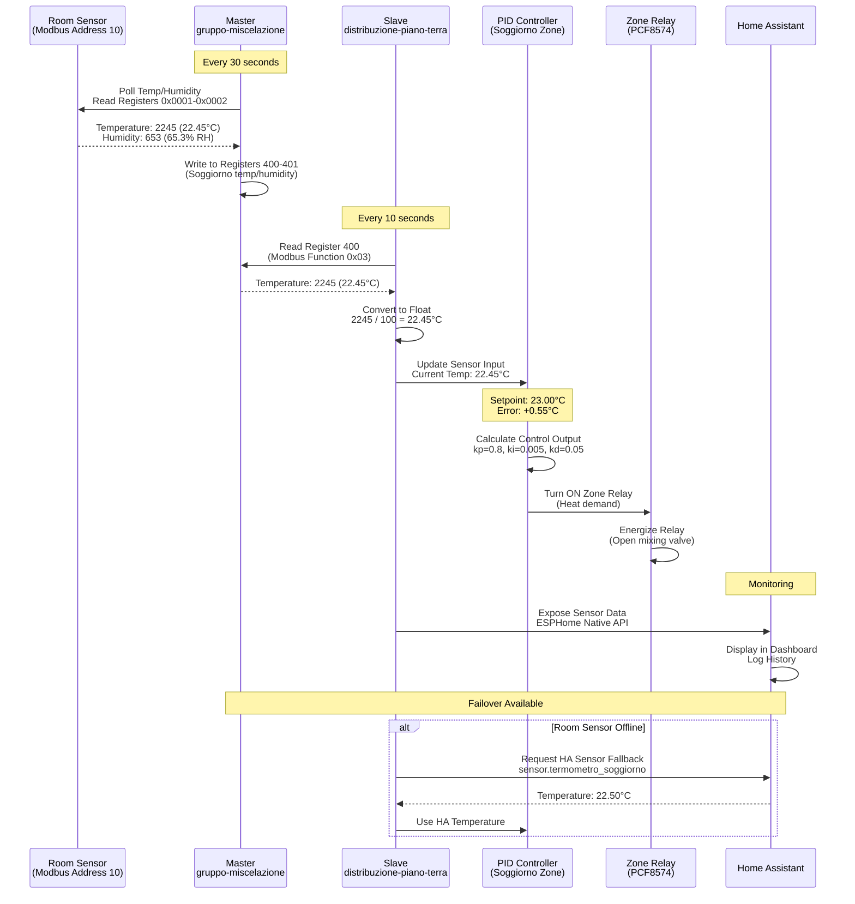
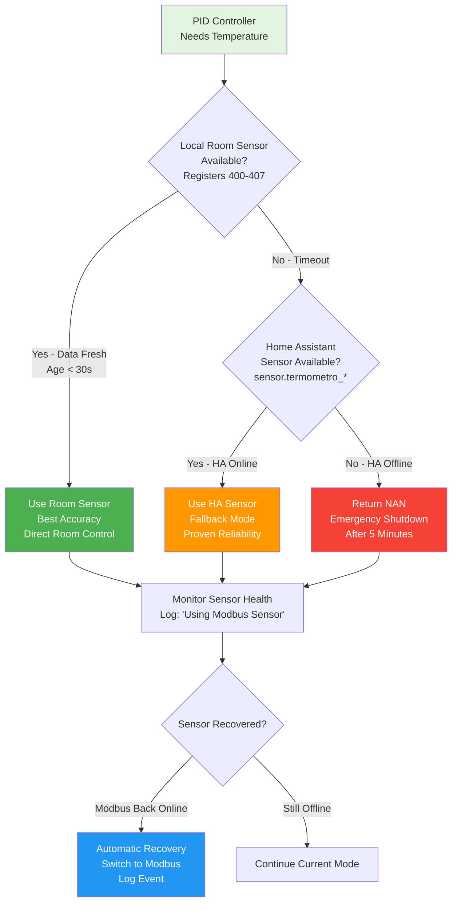
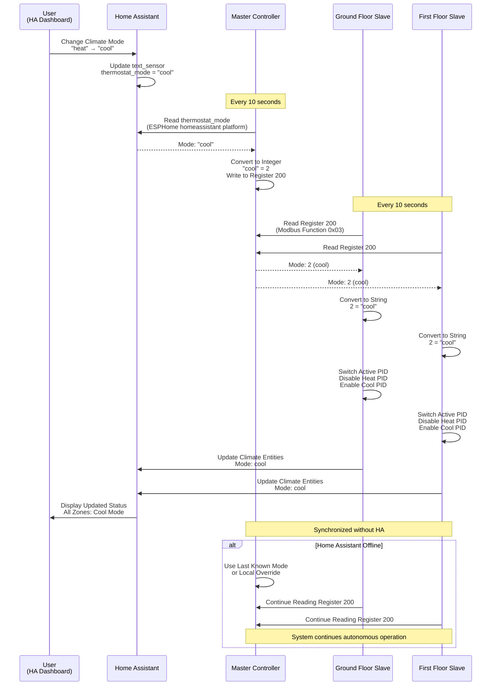
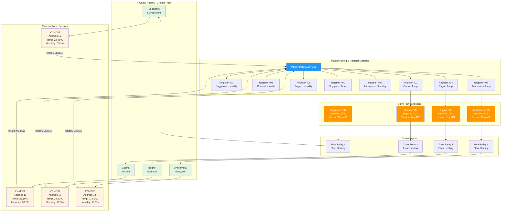
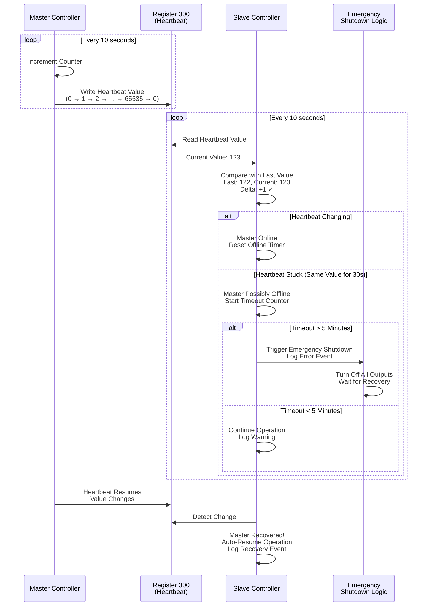
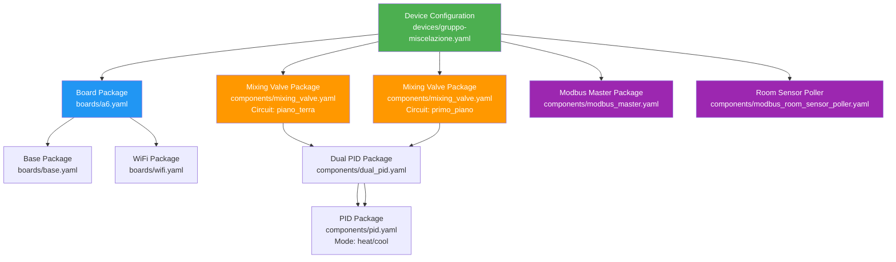

# ESPHome Climate Control - Architecture Diagrams

**Project:** ESPHome Multi-Floor Climate Control - Modbus RTU Enhancement  
**Version:** 1.0  
**Date:** October 22, 2025

This document provides visual representations of the system architecture, data flows, and key interactions using Mermaid diagrams.

## 1. System Overview - RS485 Bus Topology

**Key Points:**
- Daisy-chain topology: Master → Slaves → Sensors → 0-10V devices
- 120Ω termination resistors at BOTH ends (master + last device)
- All devices share common A/B bus (twisted pair, shielded)
- Maximum cable length: ~1200m total (RS485 standard)

---

## 2. Network Topology - All Communication Paths

**Communication Paths:**
1. **Home Assistant ↔ All Boards:** ESPHome Native API over Ethernet (sensor data, control commands)
2. **Master → Slaves:** Modbus RTU over RS485 (temperature, mode, heartbeat, room sensors)
3. **Master → Room Sensors:** Modbus RTU polling (room temperature/humidity)
4. **Local I2C/1-Wire:** On-board sensor/relay communication

---

## 3. Data Flow - Temperature Control Loop

**Data Flow Summary:**
1. Master polls room sensors every 30s
2. Master writes sensor data to registers 400-407
3. Slave reads room data from master every 10s
4. Slave converts scaled integers to floats
5. PID controller uses room temperature for control
6. Relay output controls zone heating/cooling
7. Home Assistant monitors all entities

---

## 4. Sensor Failover Decision Tree

**Failover Tiers:**
1. **Primary (Best):** Local Modbus room sensor - Fastest, most accurate
2. **Fallback (Good):** Home Assistant sensor - Proven, reliable
3. **Emergency (Degraded):** NAN → Safe shutdown after 5 minutes

**Recovery:** Automatic transition back to Modbus when sensor recovers

---

## 5. Climate Mode Synchronization

**Synchronization Benefits:**
- All zones switch modes simultaneously
- No per-zone mode configuration needed
- System continues if Home Assistant offline
- Mode persists across slave reboots (read from master)

---

## 6. Room Sensor Integration Architecture

**Room Sensor Flow:**
1. Physical sensors measure room conditions
2. Master polls sensors via Modbus (30s interval)
3. Master writes sensor data to registers 400-407
4. Slave PID controllers read room temperature from registers
5. PIDs adjust zone outputs to maintain setpoints
6. Closed-loop control: Room → Sensor → Register → PID → Output → Room

---

## 7. Master Heartbeat Monitoring

**Heartbeat Purpose:**
- Slave detects master failures
- Timeout protection (emergency shutdown after 5 minutes)
- Automatic recovery when master returns
- Prevents stale data from controlling climate

---

## 8. Component Package Composition

**Package Composition Pattern:**
- Top-level device config includes board + components
- Components are reusable with `vars:` parameterization
- Multi-level composition (mixing_valve → dual_pid → pid)
- Modular architecture enables easy expansion

---

## Diagram Export

These diagrams are written in Mermaid syntax and can be:
1. **Viewed in GitHub:** Mermaid renders automatically in GitHub markdown
2. **Exported as PNG:** Use Mermaid Live Editor (https://mermaid.live) → Export → PNG
3. **Embedded in Documentation:** Copy PNG files to `docs/images/` folder

---

## References

- **Architecture Documentation:** `docs/architecture.md`
- **Modbus Register Map:** `docs/modbus-register-map.md`
- **RS485 Wiring Guide:** `docs/rs485-wiring-guide.md`
- **Deployment Guide:** `docs/deployment-guide.md`

---

**Version History:**

| Date       | Version | Changes                        | Author            |
| ---------- | ------- | ------------------------------ | ----------------- |
| 2025-10-22 | 1.0     | Initial diagrams (Story 1.7)   | James (Dev Agent) |
