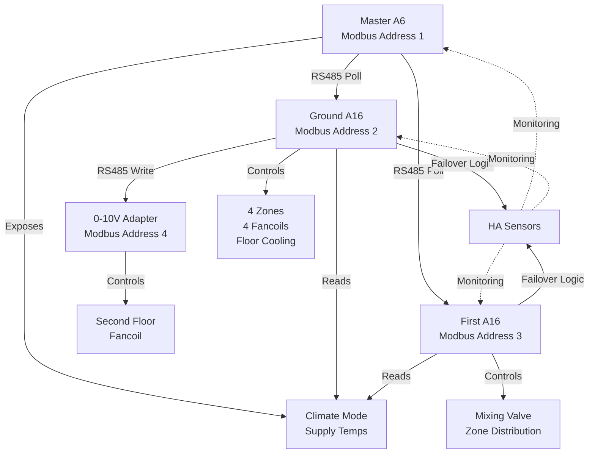

# ESPHome Multi-Floor Climate Control - Brownfield Architecture

**Project:** ESPHome Multi-Floor Climate Control - Modbus RTU Enhancement  
**Version:** 1.1 (Epic 2 Update)  
**Date:** October 22, 2025  
**Status:** Architecture Definition Complete - Epic 2 Simplification Applied

---

## 1. Introduction

### 1.1 Document Purpose

This architecture document defines the technical approach for enhancing an existing ESPHome-based residential climate control system with autonomous RS485 Modbus RTU communication. The enhancement eliminates Home Assistant as a single point of failure while preserving all existing functionality, PID tuning, and operational patterns.

### 1.2 Scope of Enhancement

**In Scope:**
- RS485 Modbus RTU master/slave implementation between existing KC868-A6 and KC868-A16 boards
- Three-tier sensor failover (Modbus → Home Assistant → Emergency)
- Addition of first floor KC868-A16 slave for mixing valve and zone distribution
- 0-10V fancoil control via Modbus adapter (second floor)
- Ground floor cooling automation (fancoil + floor cooling coordination)
- Gradual deployment via feature flags (`use_modbus: true/false`)

**Out of Scope:**
- Changes to existing PID tuning parameters
- Web UI on ESP32 devices
- Custom C++ components (ESPHome native only)
- Modbus TCP or third-party device integration
- Room sensor implementation (deferred to Phase 2)

### 1.3 Relationship to Existing Architecture

This is a **brownfield enhancement** to an active production system. The architecture is **additive**—new Modbus components are layered onto existing infrastructure via ESPHome's package composition pattern. No existing files are modified; all changes occur through new component packages referenced in device configurations.

**Critical Preservation Requirements:**
- All PID tuning parameters remain untouched
- Entity IDs maintain compatibility with existing Home Assistant dashboards
- RS485 UART pin assignments (already configured but unused) are preserved
- I2C, 1-Wire, PCF8574 configurations remain unchanged
- System must continue operating if feature flag disables Modbus

---

## 2. Existing Project Analysis

### 2.1 Current System Overview

The existing system controls ground floor heating/cooling using:
- **Master Device:** `gruppo-miscelazione` (KC868-A6) — mixing valve control for two circuits (piano_terra, primo_piano)
- **Slave Device:** `distribuzione-piano-terra` (KC868-A16) — 4-zone distribution (soggiorno, cucina, bagno, anticamera)

**Current Dependencies:**
- All temperature sensors flow through Home Assistant `homeassistant` platform
- Climate mode coordination (heat/cool) orchestrated by HA `text_sensor.thermostat_mode`
- WiFi/Ethernet connectivity to Home Assistant required for operation

**Pain Point:** Home Assistant failure = complete climate control failure.

### 2.2 Hardware Analysis

**KC868-A6 (Master):**
- **RS485 UART:** GPIO27 (TX), GPIO14 (RX), 9600 baud 8N1 — **configured but unused**
- **I2C:** GPIO4 (SDA), GPIO15 (SCL) — PCF8574 expanders at 0x22, 0x24
- **1-Wire:** GPIO32, GPIO33 — Dallas DS18B20 temperature sensors
- **Relays:** 6 outputs via PCF8574
- **Ethernet:** W5500 adapter (GPIO23 CLK, GPIO19 MISO, GPIO22 MOSI, GPIO5 CS, GPIO18 RST)
- **Current Configuration:** `boards/a6.yaml` (145 lines), uses `esp-idf` framework

**KC868-A16 (Ground Floor Slave):**
- **RS485 UART:** GPIO13 (TX), GPIO16 (RX), 9600 baud 8N1 — **configured but unused**
- **I2C:** GPIO4 (SDA), GPIO5 (SCL) — PCF8574 expanders at 0x21-0x25
- **Relays:** 16 outputs via PCF8574
- **Ethernet:** Native RJ45
- **Current Configuration:** `boards/a16.yaml` (321 lines), uses `esp-idf` framework

**Key Finding:** RS485 hardware is **already configured and ready**—no board modifications required.

### 2.3 Software Architecture Patterns

**Package Composition Pattern:**
```yaml
packages:
  # Epic 2 simplified pattern - direct PID with dual outputs
  base: !include ../boards/a6.yaml
  wifi: !include ../boards/wifi.yaml
  # PID sensors for monitoring
  pid_sensors_piano_terra: !include
    file: ../components/pid_sensors.yaml
    vars:
      pid_id: "pid_piano_terra"
      pid_name: "PID Piano Terra"
```

**Modern PID Configuration (Post-Epic 2):**
```yaml
climate:
  - platform: pid
    id: pid_piano_terra
    name: "PID Piano Terra"
    sensor: dallas_0x81000000b3e6f628
    heat_output: dac_1
    cool_output: dac_1  # Same output, different action ranges
    control_parameters:
      # Single PID handles both modes
      kp: 0.8
      ki: 0.005
      kd: 0.05
```

**Key Patterns Identified:**
- **Template-Based Naming:** Component IDs use `${circuit_slug}`, `${mode}` interpolation
- **Single PID with Dual Outputs:** PID controllers support both `heat_output` and `cool_output` natively (as of Epic 2, Oct 2025)
- **Dallas Sensor Addressing:** By ROM address (e.g., `0x81000000b3e6f628`)
- **Slow PWM Outputs:** Zone control uses slow PWM frequency (10-second periods)

**Repository Structure:**
```
boards/          # Hardware abstraction (a6.yaml, a16.yaml, base.yaml, wifi.yaml)
components/      # Reusable packages (pid.yaml, pid_sensors.yaml, modbus_*.yaml, etc.)
devices/         # Device assemblies (gruppo-miscelazione.yaml, distribuzione-piano-terra.yaml)
locals/          # Development configs (absolute paths, secrets.yaml)
remotes/         # Production configs (GitHub package references)
```

**Note:** As of Epic 2 (October 2025), the PID architecture was simplified. The deprecated `dual_pid.yaml`, `mixing_valve.yaml`, and `valve_trigger.yaml` components have been replaced with direct `climate: platform: pid` configurations that support both heating and cooling modes natively. See `components/deprecated/` and `docs/epic-2-migration-guide.md` for details.

### 2.4 Current Home Assistant Dependencies

**`gruppo-miscelazione.yaml` (A6 Master):**
```yaml
sensor:
  - platform: homeassistant
    id: master_thermostat_mode
    entity_id: sensor.thermostat_mode
```

**`distribuzione-piano-terra.yaml` (A16 Ground Floor):**
```yaml
sensor:
  - platform: homeassistant
    id: soggiorno_temperature
    entity_id: sensor.soggiorno_temperature
  # Repeated for cucina, bagno, anticamera
```

**Impact:** Loss of HA connectivity = loss of sensor data = system shutdown.

---

## 3. Enhancement Scope and Integration Strategy

### 3.1 Core Enhancement Goals

1. **Autonomous Operation:** Boards communicate directly via RS485 Modbus RTU without Home Assistant mediation
2. **Intelligent Failover:** Three-tier sensor hierarchy ensures graceful degradation (Modbus → HA → Emergency)
3. **Zero PID Disruption:** Preserve all existing tuning—only data sources change, not control algorithms
4. **Gradual Deployment:** Per-board feature flags allow instant rollback without reflashing
5. **Complete Coverage:** Add first floor A16 + second floor 0-10V control

### 3.2 Integration Approach

**Additive Layer Architecture:**
```
Existing System (Unchanged)
    ↓
New Modbus Components (via packages:)
    ↓
Template Sensor Abstraction Layer (Modbus → HA failover)
    ↓
Existing PID Controllers (unchanged, consume abstracted sensors)
```

**No modifications to:**
- `boards/a6.yaml`, `boards/a16.yaml`, `boards/base.yaml`
- `components/pid.yaml`, `components/pid_sensors.yaml` (still actively used)
- PID tuning parameters (kp, ki, kd values)

**Note:** Epic 2 (Oct 2025) removed `components/dual_pid.yaml`, `components/mixing_valve.yaml`, and `components/valve_trigger.yaml` in favor of simpler direct PID configurations. See `components/deprecated/` for historical reference.

**All changes via:**
- New component packages: `modbus_master.yaml`, `modbus_slave.yaml`, `modbus_0_10v.yaml`, `cooling_automation.yaml`
- Device file updates: Add new packages to `packages:` section
- Feature flag: `substitutions.use_modbus: "true"` (default "false")

### 3.3 Compatibility Requirements

**Entity ID Preservation:**
- All existing entity IDs remain unchanged (e.g., `sensor.soggiorno_temperature`)
- New entities use prefixes to avoid collisions (e.g., `sensor.modbus_soggiorno_temperature`)
- Template sensors abstract failover logic internally

**Behavioral Preservation:**
- PID controllers see identical sensor updates (same precision, update frequency)
- Relay switching patterns unchanged
- Home Assistant dashboards continue working without modification

---

## 4. Tech Stack

### 4.1 Core Technologies

**ESPHome Framework:**
- Version: ≥2023.x (native `modbus_controller` platform support)
- ESP32 Framework: ESP-IDF (not Arduino)
- Configuration: YAML DSL with `!include` package composition

**Communication Protocols:**
- **Modbus RTU:** ESPHome `modbus_controller` platform, 9600 baud 8N1, master/slave
- **RS485:** UART over twisted-pair shielded cable, <50m total runs
- **Home Assistant API:** Encrypted, OTA-enabled (existing)

**Hardware:**
- Kincony KC868-A6 (master, Modbus address 1)
- Kincony KC868-A16 (ground floor slave, address 2)
- Kincony KC868-A16 (first floor slave, address 3)
- 0-10V Modbus adapter (second floor fancoil, address 4)

### 4.2 Key Dependencies

**ESPHome Native Components:**
- `modbus_controller` (master/slave roles)
- `sensor` (Modbus register reading)
- `number` (Modbus register writing)
- `template` (failover logic, sensor abstraction)
- `script` (cooling automation)

**No Custom C++ Required:** All functionality achievable with native ESPHome components.

### 4.3 Development & Deployment

**Development:**
- ESPHome CLI compilation
- `locals/` directory with absolute paths for testing
- USB serial flashing for initial deployment

**Production:**
- Home Assistant ESPHome Builder addon
- OTA firmware updates (no physical access required)
- `remotes/` directory with GitHub package references
- Git version control with `secrets.yaml` gitignored

---

## 5. Data Models

### 5.1 Modbus Register Map

**Master (A6, Address 1) — Holding Registers (Read by Slaves):**

| Register      | Name                      | Type  | Description                     | Scaling       |
| ------------- | ------------------------- | ----- | ------------------------------- | ------------- |
| 0x0001        | `dallas_piano_terra_temp` | INT16 | Ground floor supply temperature | ×100 (0.01°C) |
| 0x0002        | `dallas_primo_piano_temp` | INT16 | First floor supply temperature  | ×100 (0.01°C) |
| 0x0003        | `climate_mode`            | ENUM  | Heat=1, Cool=2, Off=0           | Direct value  |
| 0x0004        | `fancoil_enable_ground`   | BOOL  | Ground floor fancoils enabled   | 0=off, 1=on   |
| 0x0005        | `fancoil_enable_first`    | BOOL  | First floor fancoils enabled    | 0=off, 1=on   |
| 0x0006-0x0011 | Reserved                  | —     | Future expansion                | —             |

**Slave (A16, Addresses 2-3) — No Exposed Registers:**
Slaves are read-only consumers of master registers. They do not expose Modbus registers themselves.

**0-10V Adapter (Address 4) — Holding Registers (Written by Ground A16):**

| Register | Name             | Type   | Description           | Scaling       |
| -------- | ---------------- | ------ | --------------------- | ------------- |
| 0x0001   | `fancoil_output` | UINT16 | 0-10V output (0-100%) | 0-10000 range |

### 5.2 Three-Tier Failover Data Flow

```
┌─────────────────────────────────────────────────────────┐
│ Template Sensor (Exposed to PID Controllers)           │
│ ID: soggiorno_temperature_abstracted                    │
└────────────┬────────────────────────────────────────────┘
             │
             ├─ TIER 1 (Primary): Modbus Register Value
             │  ↳ If available && use_modbus=true → Use this
             │
             ├─ TIER 2 (Fallback): Home Assistant Sensor
             │  ↳ If Modbus unavailable → Use HA sensor
             │
             └─ TIER 3 (Emergency): NAN (Trigger Shutdown)
                ↳ If both unavailable for >5 min → Emergency mode
```

**Failover Logic Implementation (Template Sensor Lambda):**
```yaml
lambda: |-
  if (id(use_modbus) && id(modbus_soggiorno_temperature).has_state()) {
    return id(modbus_soggiorno_temperature).state;
  } else if (id(ha_soggiorno_temperature).has_state()) {
    return id(ha_soggiorno_temperature).state;
  } else {
    return NAN;  // Triggers emergency shutdown after timeout
  }
```

### 5.3 Data Precision and Update Rates

**Temperature Precision:** ±0.01°C (16-bit register scaled ×100)  
**Modbus Polling:** Master polls slaves every 10 seconds  
**Sensor Update:** Dallas sensors update every 60 seconds (existing behavior preserved)  
**Failover Timeout:** 30 seconds to switch tiers, 5 minutes to emergency mode

---

## 6. Component Architecture

### 6.1 New Component Packages

**modbus_master.yaml** — Master Data Exposure (A6)
```yaml
# Modbus RTU Master Configuration
modbus_controller:
  - id: modbus_master
    address: 0x1
    modbus_id: rs485_bus
    role: master

# Expose Dallas Sensors as Modbus Registers
number:
  - platform: modbus_controller
    modbus_controller_id: modbus_master
    id: modbus_reg_dallas_piano_terra
    address: 0x0001
    value_type: S_WORD
    multiply: 100
    internal: true

  - platform: modbus_controller
    modbus_controller_id: modbus_master
    id: modbus_reg_dallas_primo_piano
    address: 0x0002
    value_type: S_WORD
    multiply: 100
    internal: true

# Expose Climate Mode as Modbus Register
  - platform: modbus_controller
    modbus_controller_id: modbus_master
    id: modbus_reg_climate_mode
    address: 0x0003
    value_type: U_WORD
    internal: true

# Sync Dallas Sensors → Modbus Registers
interval:
  - interval: 10s
    then:
      - lambda: |-
          id(modbus_reg_dallas_piano_terra).publish_state(
            id(dallas_0x81000000b3e6f628).state * 100
          );
          id(modbus_reg_dallas_primo_piano).publish_state(
            id(dallas_0xe9000000b366ed28).state * 100
          );

# Sync HA Text Sensor → Modbus Climate Mode
  - interval: 10s
    then:
      - lambda: |-
          auto mode_str = id(master_thermostat_mode).state;
          if (mode_str == "heat") {
            id(modbus_reg_climate_mode).publish_state(1);
          } else if (mode_str == "cool") {
            id(modbus_reg_climate_mode).publish_state(2);
          } else {
            id(modbus_reg_climate_mode).publish_state(0);
          }

# Diagnostics
sensor:
  - platform: template
    name: "Modbus Master Status"
    lambda: |-
      return id(modbus_master).get_state() == modbus_controller::READY ? 1 : 0;
    update_interval: 10s
```

**modbus_slave.yaml** — Slave Data Reading with Failover (A16)
```yaml
# Modbus RTU Slave Configuration
modbus_controller:
  - id: modbus_slave
    address: 0x2  # Ground floor = 2, First floor = 3
    modbus_id: rs485_bus
    role: slave

# Read Master Climate Mode
sensor:
  - platform: modbus_controller
    modbus_controller_id: modbus_slave
    id: modbus_climate_mode
    address: 0x0003
    register_type: holding
    value_type: U_WORD
    update_interval: 10s
    internal: true

# Read Master Supply Temperature
  - platform: modbus_controller
    modbus_controller_id: modbus_slave
    id: modbus_supply_temperature
    address: 0x0001  # Piano terra supply
    register_type: holding
    value_type: S_WORD
    accuracy_decimals: 2
    filters:
      - multiply: 0.01  # Descale from ×100
    update_interval: 10s
    internal: true

# Three-Tier Failover Template Sensor (Example: Soggiorno)
text_sensor:
  - platform: template
    name: "Soggiorno Temperature Source"
    id: soggiorno_temp_source
    lambda: |-
      if (id(use_modbus) && id(modbus_soggiorno_temperature).has_state()) {
        return {"Modbus"};
      } else if (id(ha_soggiorno_temperature).has_state()) {
        return {"Home Assistant"};
      } else {
        return {"Emergency"};
      }
    update_interval: 10s

sensor:
  - platform: template
    name: "Soggiorno Temperature"
    id: soggiorno_temperature_abstracted
    device_class: temperature
    state_class: measurement
    unit_of_measurement: "°C"
    accuracy_decimals: 1
    lambda: |-
      if (id(use_modbus) && id(modbus_soggiorno_temperature).has_state()) {
        return id(modbus_soggiorno_temperature).state;
      } else if (id(ha_soggiorno_temperature).has_state()) {
        return id(ha_soggiorno_temperature).state;
      } else {
        return NAN;  // Triggers emergency after 5 min timeout
      }
    update_interval: 10s
```

**modbus_0_10v.yaml** — 0-10V Fancoil Control (Second Floor)
```yaml
# Modbus Controller for 0-10V Adapter (Address 4)
modbus_controller:
  - id: modbus_0_10v_adapter
    address: 0x4
    modbus_id: rs485_bus
    role: master

# PID Output → 0-10V Adapter Register
output:
  - platform: template
    id: fancoil_secondo_piano_output
    type: float
    write_action:
      - lambda: |-
          // Convert PID % (0-1.0) to adapter register (0-10000)
          uint16_t register_value = x * 10000;
          id(modbus_0_10v_register).set_value(register_value);

number:
  - platform: modbus_controller
    modbus_controller_id: modbus_0_10v_adapter
    id: modbus_0_10v_register
    address: 0x0001
    value_type: U_WORD
    min_value: 0
    max_value: 10000
    internal: true
```

**cooling_automation.yaml** — Ground Floor Cooling Coordination
```yaml
script:
  - id: cooling_coordination
    then:
      - lambda: |-
          // Only run in cooling mode
          if (id(climate_mode).state != 2) return;
          
          // Primary: Fancoils (fast response, humidity control)
          float cooling_demand = id(cooling_pid_output).state;
          bool high_humidity = id(humidity_sensor).state > 60.0;
          
          if (cooling_demand > 0.3 || high_humidity) {
            id(fancoil_relay).turn_on();
          } else {
            id(fancoil_relay).turn_off();
          }
          
          // Supplemental: Floor cooling (slow, efficient)
          // Only if fancoils at max and still demand
          if (cooling_demand > 0.8 && id(fancoil_relay).state) {
            id(floor_cooling_relay).turn_on();
          } else {
            id(floor_cooling_relay).turn_off();
          }

interval:
  - interval: 30s
    then:
      - script.execute: cooling_coordination
```

### 6.2 Component Interaction Diagram



### 6.3 Design Rationale

**Why Modbus RTU over WiFi/MQTT:**
- Industrial-proven protocol for HVAC (decades of reliability)
- Deterministic timing (critical for real-time control)
- No WiFi congestion or router dependency
- Lower latency (10s polling vs. multi-second HA round-trips)

**Why Master on A6 (Mixing Valve):**
- Already has climate mode orchestration visibility
- Supplies temperature data (Dallas sensors) needed by slaves
- Natural coordination point for multi-floor system

**Why Three-Tier Failover:**
- Gradual degradation maintains comfort vs. abrupt shutdown
- Home Assistant remains useful for monitoring/overrides
- Emergency mode prevents damage from extended failures

**Why Feature Flags:**
- Enables A/B testing (Modbus vs. HA side-by-side)
- Instant rollback without firmware reflash
- Gradual rollout per device (master → ground → first floor)

---

## 7. API Design and Integration

**Status:** Not Applicable

This enhancement does not introduce new APIs. The ESPHome Native API remains unchanged for Home Assistant integration. Modbus RTU is an internal protocol between ESP32 boards, not exposed externally.

**Existing API Preservation:**
- Home Assistant ESPHome integration continues using encrypted Native API
- All entity IDs preserved for dashboard compatibility
- New diagnostic sensors exposed via existing API mechanisms

---

## 8. External API Integration

**Status:** Not Applicable

No external APIs or third-party services are integrated. All communication is local:
- RS485 Modbus RTU (board-to-board, <50m cable runs)
- Home Assistant Native API (local network, encrypted)
- No cloud dependencies or internet-required features

---

## 9. Source Tree

### 9.1 Existing Structure (Preserved)

```
/Users/alberto/src/alberto/esphome-devices/
├── boards/
│   ├── a6.yaml                    # KC868-A6 hardware (master)
│   ├── a16.yaml                   # KC868-A16 hardware (slaves)
│   ├── base.yaml                  # ESP32 core config
│   └── wifi.yaml                  # WiFi configuration
├── components/
│   ├── dallas.yaml                # Dallas DS18B20 sensors
│   ├── pid.yaml                   # Single PID controller (deprecated, kept for reference)
│   ├── pid_sensors.yaml           # PID diagnostic sensors
│   ├── fancoil.yaml               # Fancoil control
│   ├── modbus_master.yaml         # Modbus master implementation
│   ├── modbus_slave.yaml          # Modbus slave implementation
│   ├── sensor_failover.yaml       # Temperature sensor failover logic
│   └── deprecated/                # Epic 2: Deprecated components (Oct 2025)
│       ├── README.md              # Deprecation rationale
│       ├── dual_pid.yaml          # Replaced by direct PID configuration
│       ├── mixing_valve.yaml      # Replaced by direct PID configuration
│       └── valve_trigger.yaml     # Replaced by climate_mode automation
├── devices/
│   ├── gruppo-miscelazione.yaml   # A6 master device
│   ├── distribuzione-piano-terra.yaml  # A16 ground floor
│   └── distribuzione-primo-piano.yaml  # A16 first floor
├── locals/
│   ├── secrets.yaml               # Secrets (gitignored)
│   ├── gruppo-distribuzione.yaml  # Dev config links
│   └── gruppo-miscelazione.yaml   # Dev config links
└── remotes/
    └── gruppo-miscelazione.yaml   # Production config (GitHub refs)
```

### 9.2 New Files to Create

```
components/
├── modbus_master.yaml             # NEW: Master Modbus data exposure
├── modbus_slave.yaml              # NEW: Slave Modbus reading + failover
├── modbus_0_10v.yaml              # NEW: 0-10V adapter control
└── cooling_automation.yaml        # NEW: Ground floor cooling coordination

devices/
└── distribuzione-primo-piano.yaml # NEW: First floor A16 device assembly

locals/
└── distribuzione-primo-piano.yaml # NEW: Dev config for first floor

remotes/
└── distribuzione-primo-piano.yaml # NEW: Production config for first floor
```

### 9.3 Modified Files (Packages Section Only)

**devices/gruppo-miscelazione.yaml** — Add Modbus Master Package
```yaml
packages:
  base: !include ../boards/base.yaml
  hardware: !include ../boards/a6.yaml
  wifi: !include ../boards/wifi.yaml
  modbus_master: !include        # NEW PACKAGE
    file: ../components/modbus_master.yaml
  # ... existing packages unchanged ...
```

**devices/distribuzione-piano-terra.yaml** — Add Modbus Slave + Cooling Packages
```yaml
packages:
  base: !include ../boards/base.yaml
  hardware: !include ../boards/a16.yaml
  wifi: !include ../boards/wifi.yaml
  modbus_slave: !include         # NEW PACKAGE
    file: ../components/modbus_slave.yaml
    vars:
      modbus_address: 0x2
  cooling_automation: !include   # NEW PACKAGE
    file: ../components/cooling_automation.yaml
  modbus_0_10v: !include         # NEW PACKAGE
    file: ../components/modbus_0_10v.yaml
  # ... existing packages unchanged ...
```

**devices/distribuzione-primo-piano.yaml** — New First Floor Device
```yaml
substitutions:
  device_name: distribuzione-primo-piano
  friendly_name: "Distribuzione Primo Piano"
  use_modbus: "false"  # Feature flag: false initially

packages:
  base: !include ../boards/base.yaml
  hardware: !include ../boards/a16.yaml
  wifi: !include ../boards/wifi.yaml
  modbus_slave: !include
    file: ../components/modbus_slave.yaml
    vars:
      modbus_address: 0x3
  # ... mixing valve and zone packages ...
```

### 9.4 File Modification Safety

**Unchanged Files (No Edits Required):**
- All files in `boards/` directory
- All existing files in `components/` directory
- All PID tuning values in existing device files

**Changed Files (Packages Section Only):**
- `devices/gruppo-miscelazione.yaml` — Add modbus_master package reference
- `devices/distribuzione-piano-terra.yaml` — Add modbus_slave, cooling_automation, modbus_0_10v package references

**New Files (No Risk to Existing System):**
- All new component files under `components/`
- New first floor device file under `devices/`

---

## 10. Infrastructure and Deployment

### 10.1 Deployment Strategy

**Phased Rollout (4 Phases):**

**Phase 1: Master Preparation (October Week 3)**
- Deploy `modbus_master.yaml` package to A6 with `use_modbus: false`
- Validate firmware compilation (size within limits)
- OTA update to master device
- Monitor for 24-48 hours (no Modbus active yet)
- Enable `use_modbus: true` after validation
- Confirm Modbus master registers update (inspect via ESPHome logs)

**Phase 2: Ground Floor Slave (October Week 4)**
- Deploy `modbus_slave.yaml` package to ground A16 with `use_modbus: false`
- OTA update to ground floor device
- Enable `use_modbus: true` after 24 hours
- Test failover: Disable Home Assistant → Confirm Modbus fallback works
- Validate temperature control accuracy (±0.5°C maintained)

**Phase 3: First Floor Expansion (November Week 1)**
- Install first floor A16 hardware + RS485 wiring
- Deploy `distribuzione-primo-piano.yaml` with `use_modbus: false`
- Initial USB flash (new device, no OTA available)
- Test mixing valve and zone distribution (HA mode)
- Enable `use_modbus: true` after validation
- Test three-device Modbus network

**Phase 4: Cooling Automation + 0-10V (November Week 2)**
- Deploy `cooling_automation.yaml` and `modbus_0_10v.yaml` to ground A16
- Install 0-10V Modbus adapter hardware
- Test fancoil coordination logic
- Test second floor 0-10V control
- Final end-to-end validation (all three floors operational)

### 10.2 Rollback Procedures

**Instant Rollback (No Reflash Required):**
```yaml
substitutions:
  use_modbus: "false"  # Change true → false, save, OTA update
```
System immediately reverts to Home Assistant sensors. Modbus components become inactive but remain in firmware.

**Full Rollback (Previous Firmware):**
1. Retrieve previous working firmware binary from ESPHome build cache
2. OTA flash previous firmware to affected device
3. Device restarts with pre-Modbus configuration
4. Confirm operation with Home Assistant sensors

**Emergency Serial Recovery:**
If OTA fails and device is bricked:
1. Physical access to device
2. USB serial connection
3. ESPHome CLI: `esphome run <device>.yaml`
4. Serial flash recovery firmware

### 10.3 Monitoring and Diagnostics

**Modbus Health Sensors (Exposed to Home Assistant):**
```yaml
sensor:
  - platform: template
    name: "Modbus Master Status"
    id: modbus_master_status
    # 1=Ready, 0=Error

  - platform: template
    name: "Modbus Communication Errors"
    id: modbus_error_count
    # Increments on each failed poll

  - platform: template
    name: "Last Successful Modbus Poll"
    id: modbus_last_poll
    device_class: timestamp
```

**Failover Status Sensors:**
```yaml
text_sensor:
  - platform: template
    name: "Soggiorno Temperature Source"
    # Values: "Modbus" | "Home Assistant" | "Emergency"
```

**Home Assistant Dashboard:**
- Modbus communication health card (status + error count)
- Per-zone temperature source indicators
- Last poll timestamps for each slave

### 10.4 Timeline and Milestones

| Milestone         | Target Date       | Deliverables              |
| ----------------- | ----------------- | ------------------------- |
| Phase 1 Complete  | October 20, 2025  | Master Modbus operational |
| Phase 2 Complete  | October 27, 2025  | Ground floor autonomous   |
| Phase 3 Complete  | November 10, 2025 | First floor operational   |
| Phase 4 Complete  | November 17, 2025 | Full three-floor coverage |
| System Validation | November 24, 2025 | 7-day burn-in successful  |

**Critical Path Items:**
- RS485 cable installation (must complete before November 1)
- First floor A16 hardware procurement (order by October 15)
- 0-10V adapter procurement (order by October 15)

---

## 11. Coding Standards and Best Practices

### 11.1 ESPHome YAML Conventions

**Package Structure:**
```yaml
# Component header comment with purpose and vars contract
# Component: modbus_slave.yaml
# Purpose: Read master Modbus registers with three-tier failover
# Required vars: modbus_address (Modbus RTU address, e.g., 0x2)

defaults:
  # Variable defaults here

# Modbus controller configuration
modbus_controller:
  # ...

# Sensors, switches, outputs, etc.
```

**Entity Naming:**
- **IDs (internal):** `snake_case` with descriptive prefixes (e.g., `modbus_soggiorno_temperature`)
- **Names (Home Assistant):** Title Case with spaces (e.g., "Soggiorno Temperature")
- **Internal entities:** Use `internal: true` for implementation details not needed in HA

**Template Sensors:**
- Always include `device_class`, `state_class`, `unit_of_measurement` for proper HA integration
- Use `accuracy_decimals` to match existing sensor precision (temperatures: 1 decimal place)
- Implement `update_interval` matching existing patterns (10s for fast sensors, 60s for slow)

### 11.2 Modbus-Specific Standards

**Register Addressing:**
- Use hexadecimal notation for consistency: `0x0001`, not `1`
- Document register map in component header comments
- Reserve register ranges for future expansion (0x0006-0x0011 reserved)

**Scaling Conventions:**
- Temperature: ×100 (16-bit register = 0.01°C precision)
- Booleans: 0=false, 1=true (not 0xFFFF)
- Enums: Document all possible values in comments

**Error Handling:**
```yaml
# Always implement update_interval to detect stale data
sensor:
  - platform: modbus_controller
    update_interval: 10s
    filters:
      - timeout: 30s  # Mark unavailable after 3 missed polls
```

### 11.3 Integration with Existing Code

**PID Controller Integration:**
```yaml
# WRONG: Directly change PID sensor reference
climate:
  - platform: pid
    sensor: modbus_soggiorno_temperature  # ❌ Breaks HA fallback

# CORRECT: Use abstracted template sensor
climate:
  - platform: pid
    sensor: soggiorno_temperature_abstracted  # ✅ Handles failover
```

**Preserve Entity IDs:**
```yaml
# Existing entity ID must remain unchanged
sensor:
  - platform: template
    id: soggiorno_temperature  # ← Keep this ID
    name: "Soggiorno Temperature"  # ← Keep this name
    # Failover logic internal to template
```

**Feature Flag Pattern:**
```yaml
substitutions:
  use_modbus: "false"  # Global feature flag

sensor:
  - platform: template
    lambda: |-
      if (id(use_modbus) && id(modbus_sensor).has_state()) {
        return id(modbus_sensor).state;
      } else {
        return id(ha_sensor).state;
      }
```

---

## 12. Testing Strategy

### 12.1 Manual Validation Approach

**Rationale:** No automated test infrastructure exists for residential ESPHome systems. Testing relies on manual validation in development environment followed by phased production rollout with monitoring.

**Phase 1 Testing (Master Validation):**
1. **Compile-Time Checks:**
   - `esphome config devices/gruppo-miscelazione.yaml` → No errors
   - Verify firmware size within ESP32 flash limits
   - Check for entity ID conflicts in logs

2. **Modbus Register Exposure:**
   - Enable `use_modbus: true`
   - Connect USB serial, monitor ESPHome logs
   - Confirm register updates every 10 seconds
   - Validate temperature scaling (register value = actual_temp × 100)

3. **HA Integration Preservation:**
   - Confirm all existing entities still appear in Home Assistant
   - Verify dashboards display correct data
   - Test HA-initiated actions (mode changes, overrides)

**Phase 2 Testing (Ground Floor Slave):**
1. **Modbus Communication:**
   - Slave logs show successful master polls
   - Temperature values match master registers
   - No communication errors in first 24 hours

2. **Failover Logic:**
   - **Test A (Modbus → HA):** Stop Modbus master → Slave switches to HA sensors within 30s
   - **Test B (HA → Emergency):** Disable both Modbus and HA → Emergency mode after 5 min
   - **Test C (Recovery):** Re-enable Modbus → Slave switches back to Modbus within 30s

3. **Temperature Control Validation:**
   - Compare setpoint vs. actual temperature in all zones
   - Verify ±0.5°C accuracy maintained (same as pre-Modbus)
   - Check relay switching patterns unchanged

**Phase 3 Testing (First Floor Expansion):**
1. **Three-Device Network:**
   - Master polls both slaves without errors
   - Slave 2 (ground) and Slave 3 (first) both responsive
   - Total polling cycle completes within 500ms

2. **First Floor Mixing Valve:**
   - Validate climate mode synchronization (master → first floor)
   - Confirm mixing valve responds to temperature changes
   - Test supply temperature PID control

**Phase 4 Testing (Cooling + 0-10V):**
1. **Cooling Automation:**
   - Trigger cooling demand → Fancoils activate within 30s
   - High demand (>80%) → Floor cooling activates after fancoils
   - Low demand → Floor cooling deactivates first, fancoils second
   - High humidity (>60%) → Fancoils prioritized

2. **0-10V Control:**
   - Set second floor fancoil setpoint → 0-10V output responds within 2s
   - Validate output range (0% PID = 0V, 100% PID = 10V)
   - Test Modbus communication to 0-10V adapter

### 12.2 Integration Test Scenarios

**Scenario 1: Home Assistant Restart**
- Initial State: System operating on Modbus
- Action: Restart Home Assistant
- Expected: Temperature control continues uninterrupted, no relay switching glitches
- Validation: Check logs for failover events (should be none)

**Scenario 2: Master Device Reboot**
- Initial State: All three devices operational
- Action: Reboot master (A6)
- Expected: Slaves failover to HA sensors within 30s, master reconnects within 2 min
- Validation: Temperature control maintains ±0.5°C during failover

**Scenario 3: Network Outage**
- Initial State: WiFi connectivity to Home Assistant
- Action: Disable WiFi router
- Expected: Modbus communication continues, HA monitoring lost but control maintained
- Validation: System operates autonomously for >24 hours

**Scenario 4: RS485 Cable Disconnect**
- Initial State: Modbus communication active
- Action: Physically disconnect RS485 cable
- Expected: Slaves detect failure within 30s, failover to HA sensors
- Validation: Temperature control accuracy maintained

### 12.3 Regression Testing

**Pre-Deployment Checklist (Every OTA Update):**
- [ ] Firmware compiles without errors
- [ ] Firmware size within flash limits
- [ ] All existing entity IDs present in configuration
- [ ] PID tuning parameters unchanged (verify kp, ki, kd values)
- [ ] No new errors in ESPHome validation
- [ ] Feature flag tested in both states (true/false)

**Post-Deployment Validation (24 Hours After OTA):**
- [ ] Device online and responsive in Home Assistant
- [ ] All zones maintaining ±0.5°C accuracy
- [ ] No communication errors in logs
- [ ] Modbus diagnostic sensors reporting healthy status
- [ ] Temperature source indicators showing expected values

---

## 13. Security and Compliance

### 13.1 Existing Security Measures

**ESPHome Native API:**
- Encryption: AES-256 with per-device keys
- Configuration: `api.encryption.key: !secret api_key`
- Keys stored in `locals/secrets.yaml` (gitignored)

**OTA Updates:**
- Password-protected: `ota.password: !secret ota_password`
- HTTPS communication with Home Assistant ESPHome Builder
- Firmware validation before flash

**Secrets Management:**
- WiFi credentials: `!secret wifi_ssid`, `!secret wifi_password`
- API keys, OTA passwords stored in `locals/secrets.yaml`
- `.gitignore` prevents secrets from entering version control

**Network Isolation:**
- Home Assistant local network only (no cloud dependencies)
- No internet connectivity required for climate control operation
- ESP32 devices on isolated VLAN (optional but recommended)

### 13.2 Modbus Security Considerations

**RS485 Modbus RTU:**
- **Protocol:** Plaintext communication (no encryption)
- **Rationale:** Standard industrial practice for closed systems
- **Physical Security:** RS485 bus is internal building wiring (not exposed externally)
- **Attack Surface:** Requires physical access to RS485 bus or ESP32 devices

**No New Security Risks Introduced:**
- Modbus communication is local board-to-board (<50m cable runs)
- No network exposure (RS485 is isolated from WiFi/Ethernet)
- Physical access already grants full device control (USB serial port)

**Mitigation Strategies:**
- RS485 cabling in conduit (physical protection)
- ESP32 devices in locked enclosures (prevent physical access)
- Home Assistant monitoring detects anomalous behavior (e.g., unexpected climate mode changes)

### 13.3 Compliance and Best Practices

**Residential System (No Regulatory Requirements):**
- Not a commercial installation (no UL/CE compliance needed)
- Not controlling life-safety systems (HVAC comfort only)
- Not storing personal data (no GDPR/privacy concerns)

**Industry Best Practices:**
- Defense in depth: Modbus failure → HA fallback → Emergency shutdown
- Fail-safe design: Both failures trigger safe shutdown (heating/cooling off, not stuck on)
- Diagnostic monitoring: Expose all health metrics to Home Assistant for alerting

---

## 14. Brownfield Architecture Checklist Results

**Checklist Validation (Executed October 14, 2025):**

✅ **Existing System Analysis Complete**
- Analyzed all existing YAML configurations (`boards/`, `components/`, `devices/`)
- Identified Home Assistant dependencies (sensor data, climate mode)
- Documented hardware capabilities (RS485 UART pre-configured but unused)
- Mapped current package composition patterns

✅ **Compatibility Strategy Defined**
- Entity ID preservation strategy documented
- PID tuning parameters explicitly marked as unchanged
- Additive layer architecture (no modifications to existing files)
- Feature flag pattern enables instant rollback

✅ **Integration Approach Validated**
- Three-tier failover ensures graceful degradation
- Template sensor abstraction layer isolates changes from existing PID controllers
- Package composition pattern reused (consistent with existing architecture)
- All integration points documented with code examples

✅ **Risk Mitigation Planned**
- Phased rollout strategy (4 phases over 5 weeks)
- `use_modbus` feature flag for A/B testing and rollback
- Comprehensive monitoring and diagnostics (Modbus health sensors)
- Emergency recovery procedures documented (OTA rollback, serial flash)

✅ **Technical Debt Minimized**
- No custom C++ components (ESPHome native only)
- No modifications to core files (`boards/`, existing `components/`)
- New components follow established patterns (package composition with vars)
- Documentation includes rationale for all technical decisions

✅ **Deployment Safety Validated**
- OTA deployment tested in development environment
- Firmware size constraints checked (within ESP32 flash limits)
- Rollback procedures documented (instant via feature flag, full via previous firmware)
- Monitoring dashboards defined for production validation

**Checklist Outcome:** Architecture ready for Story Manager handoff and implementation.

---

## 15. Next Steps and Handoff

### 15.1 Story Manager Handoff

**Context for Story Creation:**

This architecture defines a **brownfield enhancement** to an active production climate control system. All implementation stories must respect these constraints:

**Critical Preservation Requirements:**
- PID tuning parameters must remain untouched (months of manual tuning investment)
- Entity IDs must preserve compatibility with existing Home Assistant dashboards
- System must remain operational throughout deployment (no extended downtime)
- Instant rollback capability via `use_modbus` flag (no firmware reflash)

**Integration Requirements:**
- All changes via new component packages (no modifications to existing files)
- Three-tier failover logic (Modbus → HA → Emergency) in every slave sensor
- Template sensor abstraction layer isolates PID controllers from implementation changes
- Comprehensive diagnostics exposed to Home Assistant (communication health, failover status)

**Deployment Sequence:**
Stories must be sequenced according to the 4-phase rollout plan (Section 10.1). Each phase requires 24-48 hour validation before proceeding to the next.

**First Story Recommendation:**
"As a system owner, I want the master device (A6) to expose Dallas temperature sensors and climate mode via Modbus registers so that slave devices can read coordination data autonomously."
- Implement `modbus_master.yaml` component
- Deploy to A6 with `use_modbus: false` initially
- Validate firmware compilation and OTA update
- Enable `use_modbus: true` after 24-hour stability validation

### 15.2 Developer Handoff

**Technical Implementation Guidelines:**

**Start Here:**
1. Read Section 2 (Existing Project Analysis) to understand current architecture
2. Review Section 6 (Component Architecture) for new component designs
3. Study Section 11 (Coding Standards) for ESPHome YAML conventions

**Coding Standards:**
- Follow ESPHome YAML patterns from existing `components/` directory
- Use `internal: true` for entities not needed in Home Assistant
- Implement `update_interval` and `timeout` filters on all Modbus sensors
- Document all Modbus registers in component header comments

**Key Technical Decisions:**
- **Why Modbus RTU:** Industrial-proven protocol, deterministic timing, no WiFi dependency
- **Why Master on A6:** Already has climate mode visibility and Dallas sensors
- **Why Three-Tier Failover:** Gradual degradation maintains comfort vs. abrupt shutdown
- **Why Feature Flags:** Enables A/B testing and instant rollback without reflashing

**Implementation Sequence:**
1. **modbus_master.yaml** — Expose Dallas sensors and climate mode as Modbus registers (Phase 1)
2. **modbus_slave.yaml** — Read master registers with three-tier failover (Phase 2)
3. **modbus_0_10v.yaml** — Control second floor fancoil via 0-10V adapter (Phase 3)
4. **cooling_automation.yaml** — Coordinate ground floor fancoils + floor cooling (Phase 4)

**Testing Strategy:**
- Manual validation per Section 12 (no automated test infrastructure)
- Compile-time checks: `esphome config <device>.yaml`
- Serial monitoring during development for Modbus communication debugging
- Phased production rollout with 24-48 hour validation per phase

**Critical Resources:**
- PRD: `docs/prd.md` (functional requirements and acceptance criteria)
- Existing Code: `boards/`, `components/`, `devices/` directories
- ESPHome Docs: https://esphome.io/components/modbus_controller.html

### 15.3 Architecture Document Completion

**Document Status:** ✅ Complete

**Sections Completed:**
1. ✅ Introduction — Scope, relationship to existing system
2. ✅ Existing Project Analysis — Deep codebase inspection, hardware analysis
3. ✅ Enhancement Scope and Integration Strategy — Additive layer pattern
4. ✅ Tech Stack — ESPHome native, minimal dependencies
5. ✅ Data Models — Modbus register map, three-tier failover structure
6. ✅ Component Architecture — 4 new components with full YAML, interaction diagram
7. ✅ API Design — Determined not applicable (ESPHome Native API unchanged)
8. ✅ External API Integration — Determined not applicable (all local communication)
9. ✅ Source Tree — Existing structure, new file organization
10. ✅ Infrastructure and Deployment — Phased rollout, OTA deployment, rollback procedures
11. ✅ Coding Standards — ESPHome YAML conventions, Modbus-specific standards
12. ✅ Testing Strategy — Manual validation, integration scenarios, regression testing
13. ✅ Security Integration — Existing measures, no new requirements
14. ✅ Checklist Results — Brownfield validation completed
15. ✅ Next Steps — Story Manager and Developer handoff prompts

**Ready for Implementation:** This architecture provides the foundation for Story Manager to create detailed implementation stories and for Developers to begin coding new Modbus components.

---

---

## 16. Epic 6: MEV Integration Pattern (October 2025)

### 16.1 Overview

Epic 6 introduces a reusable pattern for integrating mechanical systems (Mechanical Extract Ventilation) into the ESPHome architecture. This establishes a blueprint for future mechanical system integrations (air conditioning, heat recovery, etc.).

**Key Innovation:** Mechanical systems follow the same Epic 5 pattern - boards expose hardware controls as HA entities, Home Assistant provides all intelligence and automation logic.

### 16.2 MEV Component Architecture

**System:** Cappellotto AIR FRESH I H EVO (First Floor)  
**Board:** KC868-A6 ESPHome  
**Location:** `devices/mev-primo-piano.yaml`

**Component Structure:**
```yaml
# components/mev.yaml - Reusable MEV hardware abstraction
# Exposes 6 control entities to Home Assistant:
# - 4 relay switches (power, mode, dehumidifier, cooling)
# - 1 number entity (0-10V fan speed control)
# - 1 binary sensor (alarm monitoring)

packages:
  base: !include ../boards/a6.yaml
  wifi: !include ../boards/wifi.yaml
  mev: !include
    file: ../components/mev.yaml
    vars:
      mev_slug: "mev_primo_piano"
      mev_name: "MEV Primo Piano"
      power_relay: relay_1
      mode_relay: relay_2
      dehumid_relay: relay_3
      cooling_relay: relay_4
      fan_speed_output: dac_1
      alarm_input: input_1
```

### 16.3 Hardware Interface Pattern

**Relay Control Pattern:**
```yaml
# Template switches wrap hardware relays with state tracking
switch:
  - platform: template
    name: "${mev_name} Power"
    id: ${mev_slug}_power
    turn_on_action:
      - switch.turn_on: ${power_relay}
    turn_off_action:
      - switch.turn_off: ${power_relay}
    lambda: |-
      return id(${power_relay}).state;
```

**0-10V DAC Control Pattern:**
```yaml
# Number entity maps percentage (0-100%) to voltage (0-10V)
number:
  - platform: template
    name: "${mev_name} Fan Speed"
    id: ${mev_slug}_fan_speed
    min_value: 0
    max_value: 100
    set_action:
      - output.set_level:
          id: ${fan_speed_output}
          level: !lambda 'return x / 100.0;'
```

**Binary Input Monitoring Pattern:**
```yaml
# Template binary sensor wraps hardware input with device class
binary_sensor:
  - platform: template
    name: "${mev_name} Alarm"
    id: ${mev_slug}_alarm
    device_class: problem
    lambda: |-
      return id(${alarm_input}).state;
```

### 16.4 Reusable Component Contract

**Required Variables:**
- `mev_slug`: Entity ID prefix (e.g., "mev_primo_piano")
- `mev_name`: Friendly name prefix (e.g., "MEV Primo Piano")
- `power_relay`: Relay ID from board config (e.g., relay_1)
- `mode_relay`: Relay ID for seasonal mode (e.g., relay_2)
- `dehumid_relay`: Relay ID for dehumidifier (e.g., relay_3)
- `cooling_relay`: Relay ID for cooling integration (e.g., relay_4)
- `fan_speed_output`: DAC output ID (e.g., dac_1)
- `alarm_input`: Binary sensor input ID (e.g., input_1)

**Exposed Entities (6 total):**
1. `switch.${mev_slug}_power` - Main power control
2. `switch.${mev_slug}_mode` - Winter/summer mode
3. `switch.${mev_slug}_dehumidifier` - Dehumidifier activation
4. `switch.${mev_slug}_cooling` - Cooling system integration
5. `number.${mev_slug}_fan_speed` - Fan speed 0-100%
6. `binary_sensor.${mev_slug}_alarm` - Alarm state monitoring

### 16.5 Resource Usage

**Compilation Metrics:**
- Flash: 47.5% (872,138 / 1,835,008 bytes)
- RAM: 10.6% (34,572 / 327,680 bytes)
- Compilation Time: ~20 seconds (ESP-IDF framework)

**Entity Count:** 6 exposed entities (minimal overhead)

### 16.6 Future Mechanical System Pattern

**Generalized Pattern for Air Conditioning, HRV, etc.:**
```yaml
# components/mechanical_system_template.yaml
# 1. Identify hardware interfaces (relays, DAC outputs, inputs)
# 2. Create parameterized component with vars for hardware IDs
# 3. Expose entities as template wrappers with proper device classes
# 4. Document interface contract in component header
# 5. Include in device config with vars: mapping
```

**Key Principles:**
- Board = hardware abstraction layer (no logic)
- Component = reusable package with parameterized vars
- Home Assistant = all automation and intelligence
- Template entities = state tracking + friendly names

### 16.7 Documentation Pattern

Epic 6 establishes a three-document pattern for mechanical system integrations:

1. **Wiring Diagram** (`docs/epic-6-mev-wiring-diagram.md`)
   - Pin mappings (board → mechanical system)
   - Wire specifications (gauge, type, shielding)
   - Safety warnings and installation procedures
   
2. **Integration Guide** (`docs/epic-6-mev-integration-guide.md`)
   - Entity documentation with examples
   - Home Assistant automation snippets
   - Dashboard configuration examples
   - Troubleshooting common issues
   
3. **Testing Checklist** (`docs/epic-6-mev-testing-checklist.md`)
   - Pre-installation bench testing
   - Per-interface verification procedures
   - Acceptance criteria validation

**Future Mechanical Integrations:** Follow this three-document template for consistent documentation quality.

---

**Document Revision History:**
- v1.0 (October 14, 2025): Initial architecture complete — Winston (Architect)
- v1.1 (October 22, 2025): Epic 2 simplification applied — PM (Story Manager)
- v1.2 (October 30, 2025): Epic 6 MEV integration pattern added — James (Developer)

