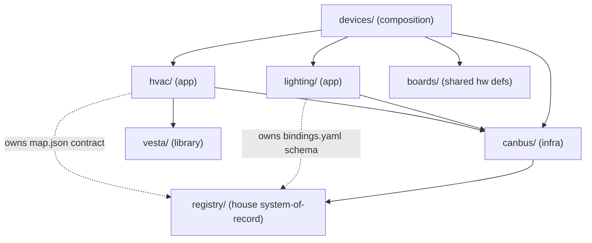

# Architecture Spine — esphome-devices layered restructure

## Design Paradigm

**Layered systems monorepo.** One shared infrastructure layer (**canbus**: CAN transport, node firmware, gateway plumbing, registry mechanism), two application systems on top (**lighting**, **hvac**), one extractable library (**vesta**), and a composition layer (**devices/**) where deployable entry points assemble packages across systems. The repo is organized by *system responsibility*, never by merge history or by physical board.



## Invariants & Rules

### AD-1 — Layered system model `[ADOPTED]`

- **Binds:** all
- **Prevents:** organizing by merge history (`canbus/` = "whatever came from the old repo"), which fuses transport with lighting and leaves the lighting system nameless; new code defaulting into the repo root.
- **Rule:** The repo contains exactly these named systems: `canbus/` (infrastructure), `lighting/` (application), `hvac/` (application), `vesta/` (library) — plus the shared `registry/`, `boards/`, the `devices/` composition layer, `docs/`, and BMAD trees. Every new file lands inside exactly one of these homes; nothing system-owned lives ambient at root. Historical `canbus/_bmad-output/` stays frozen in place.

### AD-2 — Dependency direction

- **Binds:** all
- **Prevents:** infrastructure accumulating application semantics; lateral app-to-app coupling; vesta absorbing house-specific concepts.
- **Rule:** Applications (`lighting/`, `hvac/`) may depend on `canbus/` and `vesta/`. `canbus/` depends on no application; its tooling may read application data only where a frozen contract (AD-6) names the path. `vesta/` depends on nothing in-repo. `lighting/` and `hvac/` never depend on each other — they interact only through the registry and AD-6 contracts. `devices/` may compose from everything.

### AD-3 — House registry: one mechanism, per-system file ownership

- **Binds:** registry/, canbus tooling, lighting, hvac
- **Prevents:** split push gates and duplicated hash surfaces; registry files with no owner; application schema edits treated as infra changes (or vice versa).
- **Rule:** `registry/` is a top-level directory — the single house system-of-record (git-versioned, unrebuildable data). The *mechanism* (generator, push gate, canonicalization, manifest hash) is owned by canbus. Each data file has exactly one owning system: `nodes.csv` + `node_id_hwm` → canbus; `bindings.yaml` → lighting; `map.json` → generated output whose consumer contract is owned by hvac (frozen per `spec-map-json-contract`). A schema change requires its file's owner; a mechanism change requires canbus. One push gate covers the whole registry.

### AD-4 — Systems own packages; devices own composition

- **Binds:** all firmware configs
- **Prevents:** mapping physical boards to systems (the gateway hosts infra + lighting today; a future master controller may host lighting + hvac); entry points hoarding logic that belongs in a system's packages.
- **Rule:** Reusable behavior lives in `<system>/packages/`. Hand-maintained deployable entry points (climate-control, gateway, bridge, room sensors, plus their `locals/` and `remotes/` variants) live in `devices/` and compose packages across systems. Generated node firmware is exempt (AD-8) and stays in `canbus/nodes/`. A board hosting two systems means one entry point including two systems' packages — never a new hybrid system.

### AD-5 — HA artifacts live with their system

- **Binds:** everything Home Assistant imports
- **Prevents:** HA automations detached from the system whose behavior they encode; a monolithic `home-assistant/` dir regrowing.
- **Rule:** `<system>/home-assistant/` is the only HA import surface: hold automations → `lighting/home-assistant/`; arbitration automations + generated manifest package → `canbus/home-assistant/`; dashboards → `hvac/home-assistant/`. Generators write HA-side output into the owning system's folder. The path convention *is* the answer to "what does HA import".

### AD-6 — Cross-system contract rule

- **Binds:** every boundary crossed by two systems
- **Prevents:** implicit contracts drifting silently across the new seams (the exact risk the repo merge was meant to kill).
- **Rule:** A cross-system boundary is not a contract until it has (a) a frozen spec naming the fields and (b) a test that fails when either side drifts — the `spec-map-json-contract` pattern generalized. Current instances: map.json → hvac (spec + tests exist); bindings.yaml → arbitration (spec + test due when the lighting carve-out lands, Phase 5); ADR-0006 sensor frames → hvac controller (test due when the consumer code is born).

### AD-7 — Arbitration is infra-owned and semantics-blind

- **Binds:** gateway firmware, registry/bindings.yaml, lighting fallback
- **Prevents:** a lighting schema edit silently breaking manifest-hash agreement; infra growing meaning-aware gate logic; having to extract arbitration from lighting later if hvac-on-CAN wants HA-down fallback.
- **Rule:** canbus owns canonicalization, the manifest hash, `ha_ready`, and the fallback gate; it hashes canonical bytes without interpreting them. lighting owns what the bytes mean (schema, ops, fan-out). The contract surface between them is the compiled `BindingEntry` / `bindings.h` shape (an AD-6 contract once split). Infra never adds meaning-aware logic to the gate; lighting never re-canonicalizes.

### AD-8 — Generated artifacts stay in the generator's territory `[ADOPTED]`

- **Binds:** canbus/nodes/, registry/map.json, generated HA packages
- **Prevents:** hand-edits to generated files; generated output scattered where the "never hand-edit" rule loses force.
- **Rule:** Generated files live next to (or in the territory of) their generator and are never hand-edited. An unchanged registry regenerates byte-for-byte; the idempotence check (`generate_nodes.py` then `git diff --exit-code`) is part of every migration slice and stays a standing verification.

### AD-9 — Pre-live migration discipline `[ADOPTED]`

- **Binds:** every restructure slice
- **Prevents:** shim/compat-layer creep; a moved file and its citing consumer (GitHub-path remotes, includes, generator outputs) landing in different commits and stranding a deployable ref.
- **Rule:** Moves are made in place — no shims, no compat layers, no dual paths. A move and every consumer of the moved path land in one commit. Every slice ends green: full test battery, esphome compile checks, byte-identical regeneration, push gate.

### AD-10 — Conventions are system-scoped

- **Binds:** entity IDs, AI context files, BMAD artifacts
- **Prevents:** a forced unification of two working convention sets; ambiguity about which rules govern a file.
- **Rule:** Entity-ID conventions stay per-system (hvac keeps `{scope}_{component}[_{mode}][_{aspect}]`; canbus/lighting keep theirs). Each system directory carries its own `CLAUDE.md`; the root `CLAUDE.md` is the map, not the rules. Epic prefixes: **CAN-**, **LIGHT-**, **HVAC-**. New BMAD artifacts go to root `_bmad-output/` under those prefixes.

## Consistency Conventions

| Concern | Convention |
| --- | --- |
| System directory names | lowercase, singular, the system's own name: `canbus/`, `lighting/`, `hvac/`, `vesta/` |
| HA import surface | `<system>/home-assistant/` — nothing else is imported by HA |
| Registry file ownership | one file per system, owner named in `registry/README.md`; mechanism = canbus |
| Epic / commit prefixes | `CAN-Epic N`, `LIGHT-Epic N`, `HVAC-Epic N` |
| Contract specs | `_bmad-output/specs/spec-*` + drift-breaking test, per AD-6 |
| Verification battery | python registry tests, native C++ protocol tests, `esphome compile` checks, push gate, regeneration idempotence — run per slice (AD-9) |

## Stack

Existing reality, unchanged by this spine — no new technology is bound.

| Name | Version |
| --- | --- |
| ESPHome | 2026.3.0+ (as pinned by installation) |
| Python (registry tooling, stdlib-only) | 3.x |
| C++ (protocol headers, native tests) | C++17 |
| Home Assistant | 2024.x+ |
| CAN bus | 125 kbps, 29-bit extended IDs (ADR-0001) |
| Modbus RTU (hvac boards, current transport) | 9600 8N1 |

## Structural Seed

Target tree (cold-start shape; the code owns the detail once moves land):

```text
esphome-devices/
  registry/                # house system-of-record (AD-3): nodes.csv, node_id_hwm,
                           #   bindings.yaml, map.json (generated), README.md (ownership)
  canbus/                  # INFRA: protocol/, packages/ (base_node, button, sensor_kit),
                           #   nodes/ (generated), tools/, tests/, home-assistant/,
                           #   docs/, CLAUDE.md, _bmad-output/ (frozen history)
  lighting/                # APP: packages/ (fallback/relays, as ADR-0013 lands),
                           #   home-assistant/ (hold automations), CLAUDE.md
  hvac/                    # APP: rooms/, components (mev_*, room_sensors),
                           #   home-assistant/ (dashboards), CLAUDE.md
  vesta/                   # LIBRARY: unchanged (extractable open-source)
  boards/                  # shared hardware definitions + network configs
  devices/                 # ENTRY POINTS (AD-4): climate-control, gateway (+secrets),
                           #   bridge, room sensors; locals/, remotes/
  libs/                    # custom external components (s1_pro)
  docs/                    # repo-level docs
  _bmad/  _bmad-output/    # framework + new namespaced artifacts
```

Deployment envelope (unchanged by this spine): node firmware flashed via USB pre-install (frozen); gateway/bridge/climate boards deployed via ESPHome OTA — locally from `devices/locals/`, in production via `devices/remotes/` pulling GitHub `@main` paths (hence AD-9 atomicity); HA imports only `<system>/home-assistant/` paths. Both subsystems are pre-live; there is no staging environment — the test battery + push gate are the release gate.

## Deferred

| Decision | Why it can wait |
| --- | --- |
| Wiring contract tests into the push gate itself | Spec + test battery (AD-6) suffices pre-live; revisit at live-freeze or after the first drift that escapes the battery |
| Master-controller swap (Lilygo T-Connect PRO) | Hardware call, externally gated; AD-4's composition shape is designed so the swap is a new entry point, not a restructure |
| hvac-on-CAN consumer code placement | No consumer code exists; decided when HVAC-Epic work lands it (contract already frozen) |
| Gateway package-extraction granularity (which YAML blocks become canbus vs lighting packages) | Code-level; decided in Migration Phase 5 alongside ADR-0013 open item 2 |
| boards/ package unification (gateway vs climate master, both Waveshare family) | Merge proposal's advice stands: let it fall out, don't force it |
| Vesta extraction to its own repo | Orthogonal to this restructure; AD-2 already isolates it |
| `scripts/`, root `secrets.yaml` layout | No divergence risk; whoever touches them next follows AD-1's "one home" rule |
