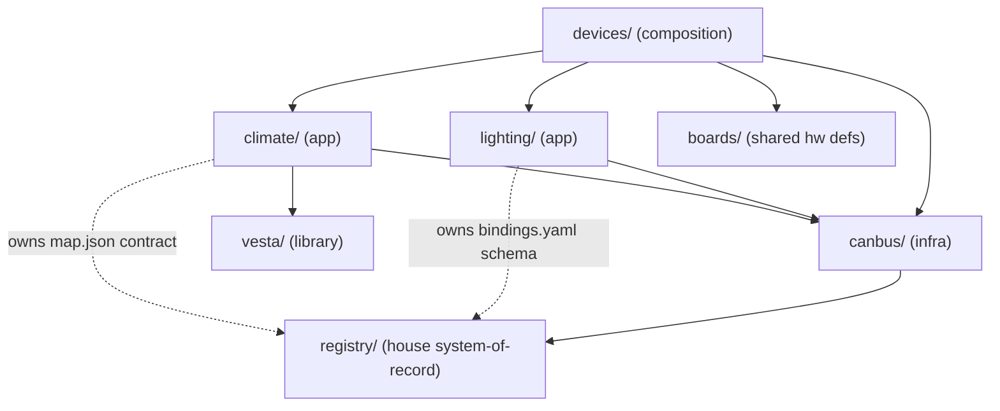

# Architecture Spine — esphome-devices layered restructure

## Design Paradigm

**Layered systems monorepo.** One shared infrastructure layer (**canbus**: CAN transport, node firmware, gateway plumbing, registry mechanism), two application systems on top (**lighting**, **climate**), one extractable library (**vesta**), and a composition layer (**devices/**) where deployable entry points assemble packages across systems. The repo is organized by *system responsibility*, never by merge history or by physical board.



## Invariants & Rules

### AD-1 — Layered system model `[ADOPTED]`

- **Binds:** all
- **Prevents:** organizing by merge history (`canbus/` = "whatever came from the old repo"), which fuses transport with lighting and leaves the lighting system nameless; new code defaulting into the repo root.
- **Rule:** The repo contains exactly these named systems: `canbus/` (infrastructure), `lighting/` (application), `climate/` (application), `vesta/` (library) — plus the shared `registry/`, `boards/`, `libs/` (custom external components), the `devices/` composition layer, `docs/`, and BMAD trees. Every new file lands inside exactly one of these homes; nothing system-owned lives ambient at root. Historical `canbus/_bmad-output/` stays frozen in place — never edited; a decision superseding a frozen-tree ADR lives in root `_bmad-output/` and cites the superseded ADR id.

### AD-2 — Dependency direction

- **Binds:** all
- **Prevents:** infrastructure accumulating application semantics; lateral app-to-app coupling; vesta absorbing house-specific concepts.
- **Rule:** Applications (`lighting/`, `climate/`) may depend on `canbus/` and `vesta/`. `canbus/` depends on no application; its tooling may read application data only where a frozen contract (AD-6) names the path. `vesta/` depends on nothing in-repo. `lighting/` and `climate/` never include or reference each other's config or code — cross-app behavior is expressed as HA automations (AD-5 decides the home) or through the registry and AD-6 contracts. `devices/` may compose from everything.

### AD-3 — House registry: one mechanism, per-system file ownership

- **Binds:** registry/, canbus tooling, lighting, climate
- **Prevents:** split push gates and duplicated hash surfaces; registry files with no owner; application schema edits treated as infra changes (or vice versa).
- **Rule:** `registry/` is a top-level directory — the single house system-of-record (git-versioned, unrebuildable data). The *mechanism* (generator, push gate, canonicalization, manifest hash) is owned by canbus. Each data file has exactly one owning system: `nodes.csv` + `node_id_hwm` → canbus; `bindings.yaml` → lighting; `map.json` → generated output whose consumer contract is owned by climate (frozen per `spec-map-json-contract`). A schema change requires its file's owner; a mechanism change requires canbus. A schema change that needs generator/mechanism support is one commit wearing two hats: the file's owner defines the semantics, canbus owns the mechanism edit, and the commit carries the initiating system's epic prefix. One push gate covers the whole registry.

### AD-4 — Systems own packages; devices own composition

- **Binds:** all firmware configs
- **Prevents:** mapping physical boards to systems (the gateway hosts infra + lighting today; a future master controller may host lighting + climate); entry points hoarding logic that belongs in a system's packages.
- **Rule:** Reusable behavior lives in `<system>/packages/`. Hand-maintained deployable entry points (climate-control, gateway, bridge, room sensors, plus their `locals/` and `remotes/` variants) live in `devices/` and compose packages across systems. Generated node firmware is exempt (AD-8) and stays in `canbus/nodes/`. `devices/` holds only configs flashed to house hardware: compile-check configs live in their system's `tests/`, examples in `vesta/examples/`. A board hosting two systems means one entry point including two systems' packages — never a new hybrid system.

### AD-5 — HA artifacts live with their system

- **Binds:** everything Home Assistant imports
- **Prevents:** HA automations detached from the system whose behavior they encode; a monolithic `home-assistant/` dir regrowing.
- **Rule:** `<system>/home-assistant/` is the only HA import surface: hold automations → `lighting/home-assistant/`; arbitration automations + generated manifest package → `canbus/home-assistant/`; dashboards → `climate/home-assistant/`. Generators write HA-side output into the owning system's folder. An automation belongs to the system whose *actuated behavior* it encodes, regardless of trigger source — a button-driven climate automation lives in `climate/home-assistant/`. The path convention *is* the answer to "what does HA import".

### AD-6 — Cross-system contract rule

- **Binds:** every boundary crossed by two systems
- **Prevents:** implicit contracts drifting silently across the new seams (the exact risk the repo merge was meant to kill).
- **Rule:** A cross-system boundary is not a contract until it has (a) a frozen spec naming the fields and (b) a test that fails when either side drifts — the `spec-map-json-contract` pattern generalized. Frozen is additive-by-default; changing a frozen field is done by the contract's owner, updating spec + test + all consumers in one commit (AD-9), with the owner's epic prefix as the ack. Current instances: map.json → climate (spec + tests exist); the compiled `bindings.h` surface → lighting's gate instance (spec + drift test exist: `spec-bindings-arbitration-contract`, `test_bindings_contract.cpp`, Phase 5b-1); the `node_map.h` frozen-additive export → its firmware consumers (same treatment); ADR-0006 sensor frames → climate controller (test due when the consumer code is born).

### AD-7 — Arbitration mechanism is infra-owned; each system owns its gate instance `[AMENDED 2026-07-06]`

- **Binds:** gateway firmware, registry/bindings.yaml, lighting fallback, any future climate-on-CAN gate
- **Prevents:** a lighting schema edit silently breaking manifest-hash agreement; infra growing meaning-aware gate logic; drift-prone logic duplication if a second system wants HA-down fallback.
- **Rule:** canbus owns canonicalization, the manifest-hash mechanism, and the arbitration *pure logic* — `ha_arbitration.h` is a shared, natively-tested infra header, exactly like `canbus_protocol.h`. Each application system owns its own gate *instance*: the YAML wiring on its gateway, the manifest-hash agreement with HA over its own data file, and its fallback actions. Today the only instance is lighting's (agreement over `bindings.yaml`; fallback per ADR-0013 when relays land). If climate-on-CAN ever needs an HA-down gate, it instantiates the same header with its own policy — no extraction, no logic copying. Canonicalization is necessarily schema-aware (it normalizes the fields it hashes — already true of `canonical_hash` today), so any lighting schema change that alters canonical form is an AD-6 contract change: owner-led, hash impact stated, both sides' manifests regenerated in the same commit. lighting owns binding meaning (schema, ops, fan-out) and never re-canonicalizes; the compiled `BindingEntry` / `bindings.h` shape is the contract surface (an AD-6 contract once split).
- **Amendment (2026-07-06, Alberto, Phase 5b scoping session):** supersedes the original "canbus owns `ha_ready` and the fallback gate" wording, together with the target gateway model: CAN consumers split by domain — lighting's gateway parses button frames and fires their HA events; the climate controller consumes sensor frames directly (contract already frozen); canbus owns transport health (heartbeats, node_lost, discovery). The *physical* split into separate devices is intended but deferred to ADR-0013's relay-hardware decision; until then one device composes both systems' packages per AD-4.

### AD-8 — Generated artifacts stay in the generator's territory `[ADOPTED]`

- **Binds:** canbus/nodes/, registry/map.json, generated HA packages
- **Prevents:** hand-edits to generated files; generated output scattered where the "never hand-edit" rule loses force.
- **Rule:** Generated files live next to (or in the territory of) their generator and are never hand-edited. An unchanged registry regenerates byte-for-byte; the idempotence check (`generate_nodes.py` then `git diff --exit-code`) is part of every migration slice and stays a standing verification.

### AD-9 — Pre-live migration discipline `[ADOPTED]`

- **Binds:** every restructure slice
- **Prevents:** shim/compat-layer creep; a moved file and its citing consumer (GitHub-path remotes, includes, generator outputs) landing in different commits and stranding a deployable ref.
- **Rule:** Moves are made in place — no shims, no compat layers, no dual paths. A move and every consumer of the moved path land in one commit. Every slice ends green: full test battery, esphome compile checks, byte-identical regeneration, push gate.

### AD-10 — Conventions are system-scoped

- **Binds:** entity IDs, AI context files, BMAD artifacts
- **Prevents:** a forced unification of two working convention sets; ambiguity about which rules govern a file.
- **Rule:** Entity-ID conventions stay per-system (climate keeps `{scope}_{component}[_{mode}][_{aspect}]`; canbus/lighting keep theirs). Each system directory carries its own `CLAUDE.md`; the root `CLAUDE.md` is the map, not the rules. Epic prefixes: **CAN-**, **LIGHT-**, **CLIMATE-**. New BMAD artifacts go to root `_bmad-output/` under those prefixes.

## Consistency Conventions

| Concern | Convention |
| --- | --- |
| System directory names | lowercase, singular, the system's own name: `canbus/`, `lighting/`, `climate/`, `vesta/` |
| HA import surface | `<system>/home-assistant/` — nothing else is imported by HA |
| Registry file ownership | one file per system, owner named in `registry/README.md`; mechanism = canbus |
| Epic / commit prefixes | `CAN-Epic N`, `LIGHT-Epic N`, `CLIMATE-Epic N` |
| Contract specs | `_bmad-output/specs/spec-*` + drift-breaking test, per AD-6 |
| `boards/` ownership | house-shared, no owning system; an edit must leave every `devices/` entry point that includes the board compiling |
| Verification battery | python registry tests, native C++ protocol tests, `esphome compile` of affected entry points, push gate, regeneration idempotence — run per slice (AD-9) |

## Stack

Existing reality, unchanged by this spine — no new technology is bound.

| Name | Version |
| --- | --- |
| ESPHome | 2026.3.0+ (`min_version` on climate boards; canbus configs unpinned; vesta test harness pins 2026.5.3) |
| Python (registry tooling, stdlib-only) | 3.x |
| C++ (protocol headers, native tests) | C++17 |
| Home Assistant | 2024.x+ |
| CAN bus | 125 kbps, 29-bit extended IDs (ADR-0001) |
| Modbus RTU (climate boards, current transport) | 38400 8E1 on the master bus (`waveshare-s3`); 9600 8N1 in A6/A16 configs — pre-existing repo inconsistency, flagged for reconciliation outside this spine |

## Structural Seed

Target tree (cold-start shape; the code owns the detail once moves land):

```text
esphome-devices/
  registry/                # house system-of-record (AD-3): nodes.csv, node_id_hwm,
                           #   bindings.yaml, map.json (generated), README.md (ownership)
  canbus/                  # INFRA: protocol/, packages/ (base_node, button, sensor_kit),
                           #   nodes/ (generated), tools/, tests/, home-assistant/,
                           #   docs/, CLAUDE.md, _bmad-output/ (frozen history)
  lighting/                # APP: packages/ (fallback/relays, as ADR-0013 lands),
                           #   home-assistant/ (hold automations), CLAUDE.md
  climate/                    # APP: rooms/, components (mev_*, room_sensors),
                           #   home-assistant/ (dashboards), CLAUDE.md
  vesta/                   # LIBRARY: unchanged (extractable open-source)
  boards/                  # shared hardware definitions + network configs
  devices/                 # ENTRY POINTS (AD-4): climate-control, gateway (+secrets),
                           #   bridge, room sensors; locals/, remotes/
  libs/                    # custom external components (s1_pro)
  docs/                    # repo-level docs
  _bmad/  _bmad-output/    # framework + new namespaced artifacts
```

Deployment envelope (unchanged by this spine): node firmware flashed via USB pre-install (frozen); gateway/bridge/climate boards deployed via ESPHome OTA — locally from `devices/locals/`, in production via `devices/remotes/` pulling GitHub `@main` paths (hence AD-9 atomicity); HA imports only `<system>/home-assistant/` paths. Both subsystems are pre-live; there is no staging environment — the test battery + push gate are the release gate.

## Deferred

| Decision | Why it can wait |
| --- | --- |
| Wiring contract tests into the push gate itself | Spec + test battery (AD-6) suffices pre-live; revisit at live-freeze or after the first drift that escapes the battery |
| Master-controller swap (Lilygo T-Connect PRO) | **Resolved** — ADR-0014 (2026-07-10), implemented P3 (climate controller) and P4 (lighting gateway). AD-4's bet held: the swap was a board-file + entry-point change, not a restructure |
| climate-on-CAN consumer code placement | No consumer code exists; decided when CLIMATE-Epic work lands it (contract already frozen) |
| Physical gateway split (dedicated lighting-gateway device vs today's single board composing canbus + lighting packages) | **Resolved** — ADR-0014 (2026-07-10): **no further split.** The gateway keeps composing canbus + lighting packages on one device (AD-4); climate was already a separate physical device; relay outputs arrived as a Modbus bank (P4), removing the "current board may lack outputs" trigger. An explicit decision now, not an open question |
| boards/ package unification (gateway vs climate master, both Waveshare family) | **Resolved as a byproduct** — exactly as this row prescribed ("let it fall out, don't force it"): ADR-0014's hardware standardization made both entry points compose the same `boards/t-connect-pro.yaml`; unification fell out of the hardware decision rather than being pursued |
| Vesta extraction to its own repo | Orthogonal to this restructure; AD-2 already isolates it |
| `scripts/`, root `secrets.yaml` layout | No divergence risk; whoever touches them next follows AD-1's "one home" rule |
| Standing battery automation (CI) | No CI exists; the battery runs per-slice and on human initiative — revisit together with the status-hygiene mechanical gate, or at live-freeze |
